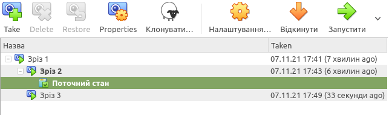

PART 1. HYPERVISORS
===================
1. What are the most popular hypervisors for infrastructure 
    1. KVM
    2. RHEV
    3. Xen
2. Briefly describe the main differences of the most popular hypervisors.
    1. KVM is open-source and can be added to a most Linux operating systems
    2. is a commercial implementation of the KVM
    3. supported PowerPC and MIPS processor families

PART 2. WORK WITH VIRTUALBOX
============================
1. user manual VirtualBox

2. create virtualmachine and install Ubuntu

3. Clone VM1 and create a group

4. take several different snapshots

5. Export VM

6. connect the USB ports of the host machine to the VM

7. Configure a shared folder

8. Work with CLI through VBoxManage.

9. Configure different network modes

PART 3. WORK WITH VAGRANT
=========================

1. initialize the environment, run vagrant up and connect using ssh

2. Create your own Vagrant box

