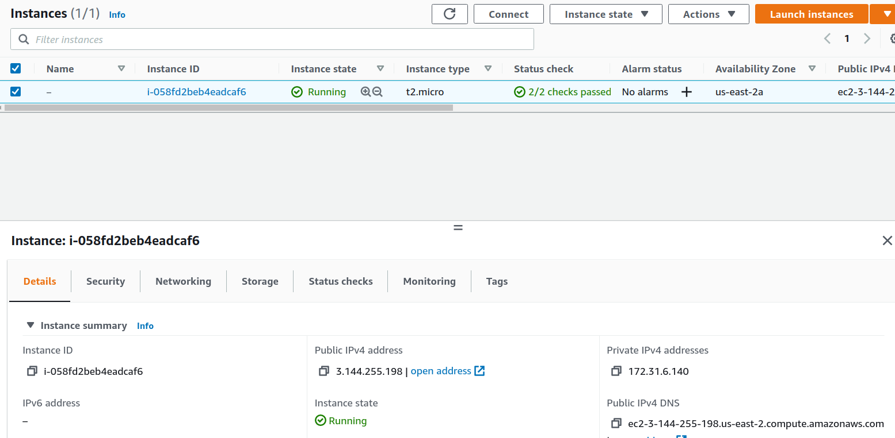

Launch a Linux Virtual Machine

Create a snapshot of your instance to keep as a backup.

Create and attach a Disk_D (EBS) to your instance to add more storage space.

upload files to the cloud to Amazon S3. Create a static website on Amazon S3

[zehrtestbucket](http://zehrtestbucket.s3-website.us-east-2.amazonaws.com/)

Deploy Docker Containers on Amazon Elastic
Container Service (Amazon ECS)

