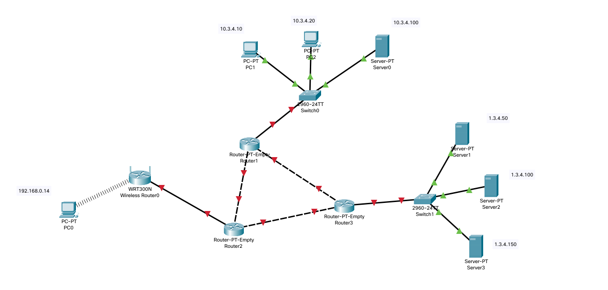
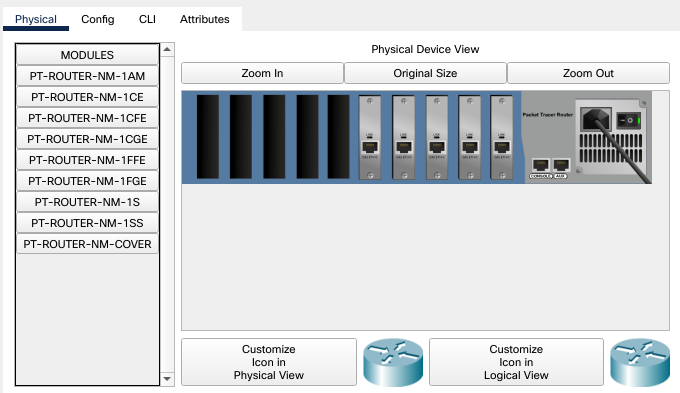
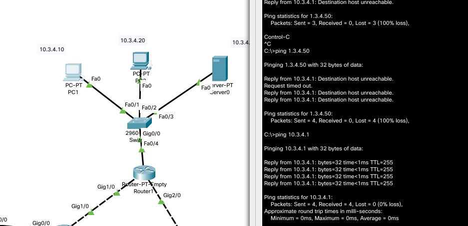
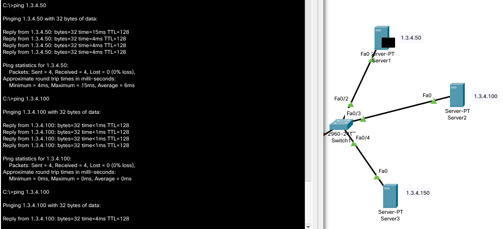
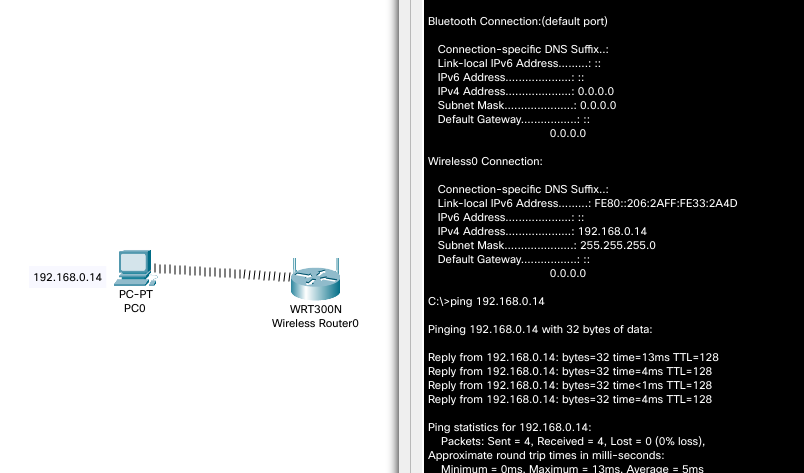
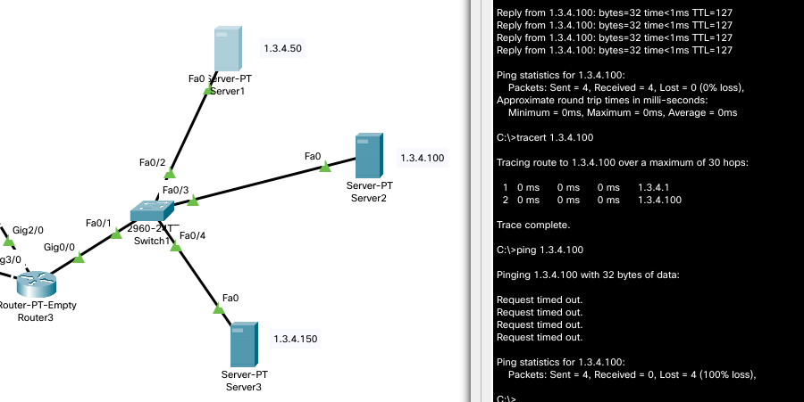

# З’єднати створені у попередньому Taskу мережі між собою

# попередньо вставити в маршрутиатори 5 модулів 1CGE

# IP для інтерфейсів маршрутизаторів
## Routr2
1. GE0/0
3.1.4.1
255.255.255.0
2. GE1/0
14.1.3.1
255.255.255.192
3. GE3/0
14.1.4.129
255.255.255.192

## Router1
1. GE0/0
10.3.4.1
255.255.255.0
2. GE1/0
14.1.3.2
255.255.255.192
3. GE2/0
14.1.3.65
255.255.255.192

## Router3
1. GE0/0
14.1.3.1
255.255.255.0
2. GE2/0
14.1.3.66
255.255.255.192
3. GE3/0
14.1.3.130
255.255.255.192

## провірка

# провітрити зв'язок між серверами, змінити маску на 255.255.255.192, провітрити знову, розкидати їх по різних VLAN, провітрити.

вузли з'єднуються через комутатор

міняємо маску на 255.255.255.192

вузли з'єднуються через gateway, бо вважають що є в різних мережах

міняємо VLAN

вузли не можуть з'єднатися навіть з роутером