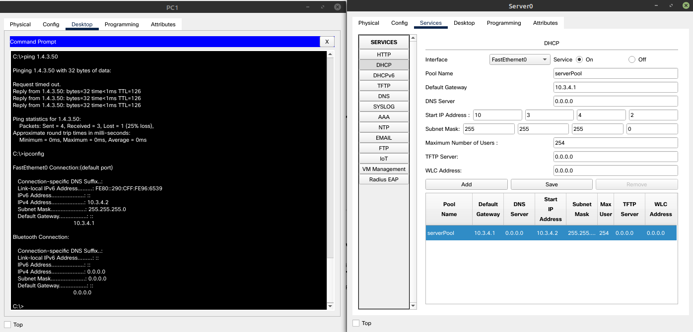
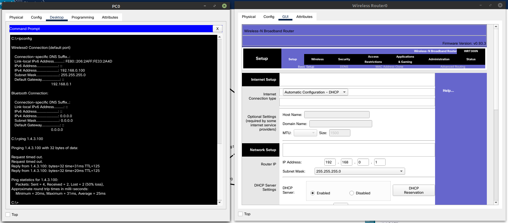
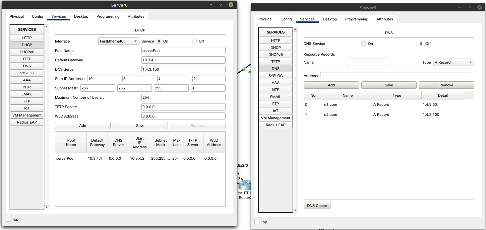
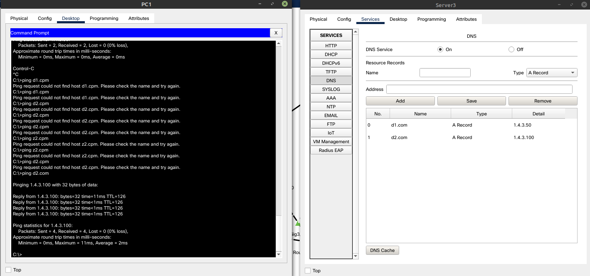
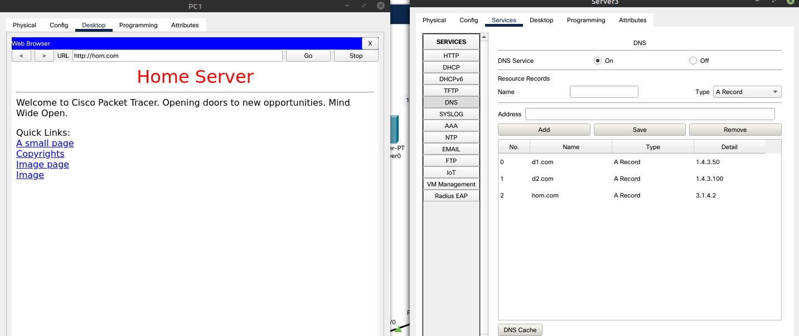

# Налаштувати DHCP Server в Enterprise мережі	

# Налаштувати DHCP на Home Router та перевірити працездатність на Client 3

# Налаштувати DNS

# Додати в мережу Home Office Home Server
налаштувати Port Forwarding, DNS, відредагувати index.html

