# Select a subject area and describe the database schema, (minimum 3 tables)
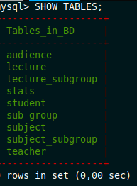

# Construct and execute SELECT operator with WHERE, GROUP BY and ORDER BY.
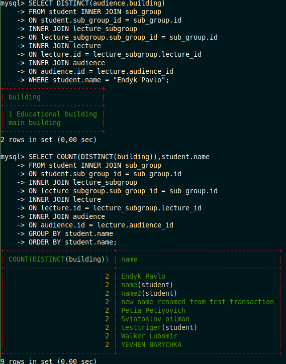

# Create a database of new users with different privileges. Connect to the database
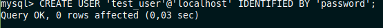
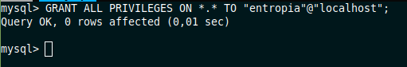

# Make a selection from the main table DB MySQL.
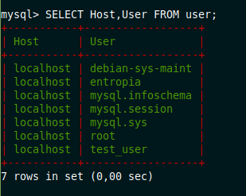

# Make backup of your database.
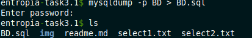

# Delete the table and/or part of the data in the table.
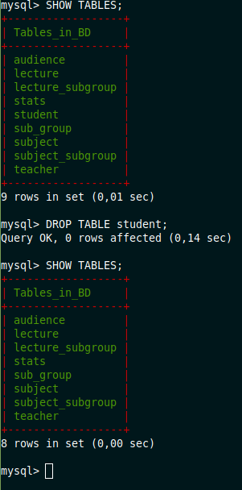

# Restore your database.
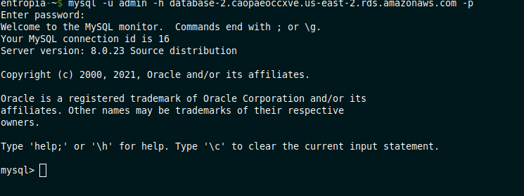
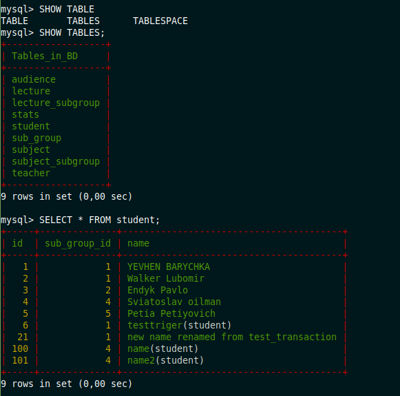 

# Create the dump of your database on RDS AWS.
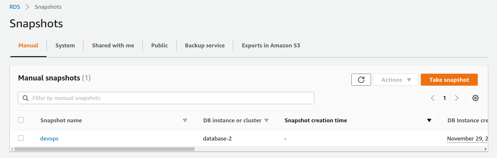

# Query an Amazon DynamoDB table.
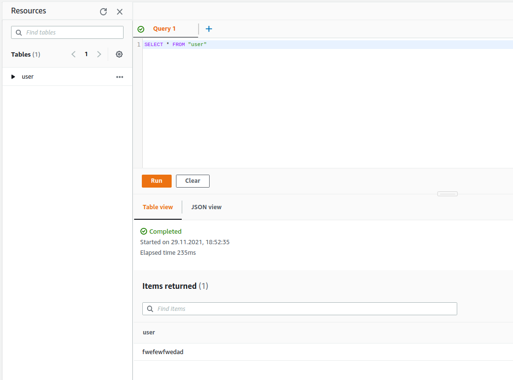
