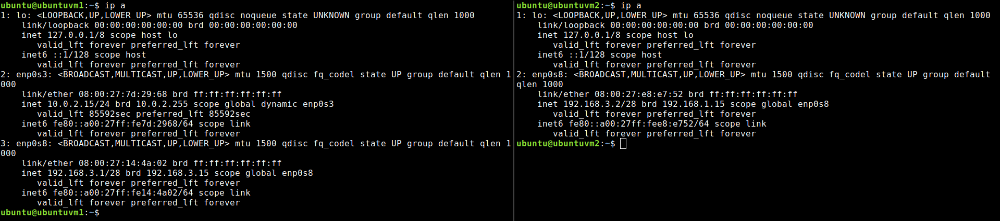
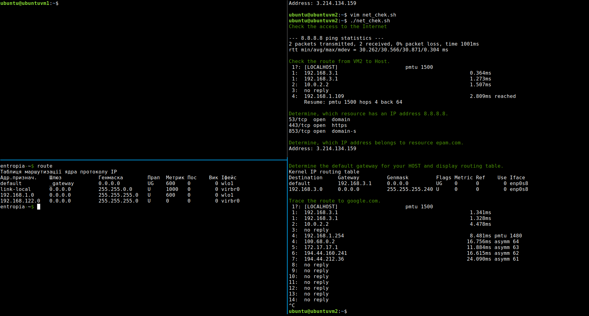

# настроюєм внутрішню мерешу
до ubuntuvm2 підключаємось по ssh через ubuntuvm1(прямого зв'язку немає).

добавляєм gateway до ubuntuvm2, на ubuntuvm1 дозволяємо форвардинг і настороюємо iptables. пишимо і запускаємо скрипт для провірки мережі.

