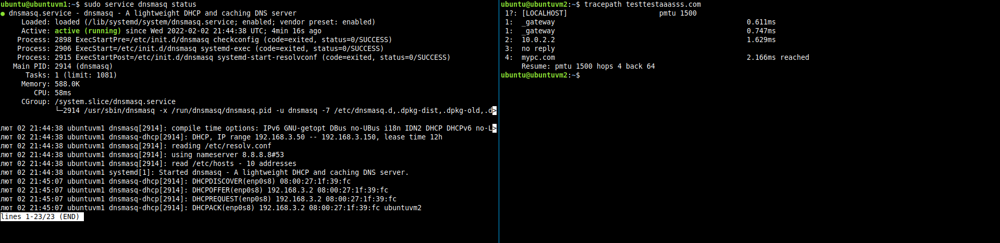

# для ubuntuvm1
установлюємо статичну ip адресу. Дозволяємо форвардинг. Встановлюємо Dnsmasq. Конфігуруємо /etc/dnsmasq.conf.
і добавляємо dns записи в /etc/hosts.
 
# для ubuntuvm2
у файлі /etc/netplan/01-netcfg.yaml включаєм dncp для enp0s8

network:

version: 2

renderer: networkd

ethernets:

enp0s8:

dhcp4: yes

